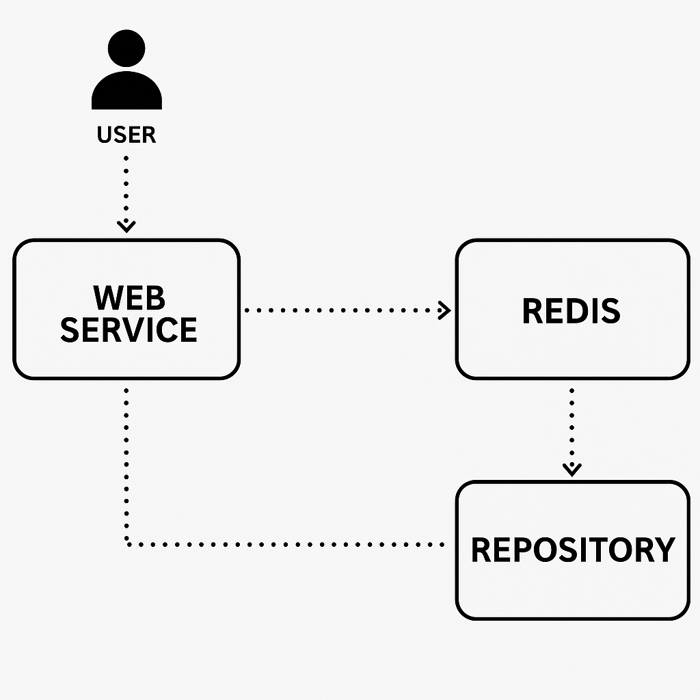

# Notes App with Flask, Redis and Docker

This is a simple notes app built using **Flask**, **Redis**, and **Docker Compose**.  
It was developed as part of a DevOps course assignment.

## Features

- Add a note (`POST /note`)
- View all notes (`GET /notes`)
- Delete a note (`DELETE /note/<id>`)
- Notes are stored in Redis and persisted using Docker volumes

---

## Technologies Used

- **Flask** – web framework (Python)
- **Redis** – in-memory database for storing notes
- **Docker Compose** – used to run and connect both services

---

## How to Run the Project

Make sure Docker and Docker Compose are installed.

1. Clone the repo:
```bash
git clone https://github.com/100adim/notes_app_devops.git
cd notes_app_devops


## System Architecture

This diagram illustrates the system architecture of the Notes App.  
The user interacts with a Flask-based web service, sending HTTP requests to add, retrieve, or delete notes.  
The web service uses Redis as the data store, and all data is persisted on the host machine using Docker volumes.  
Docker Compose is used to orchestrate both the Flask application and the Redis service.


